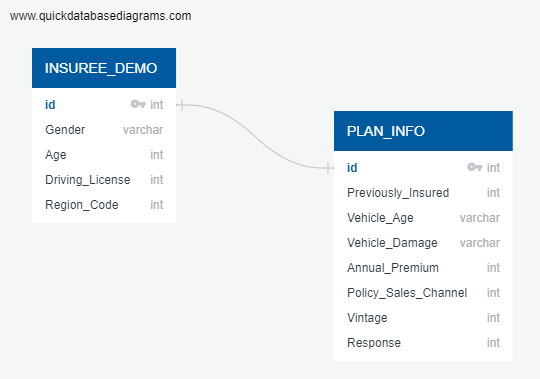

# Vehicle Insurance Cross-selling Prediction

**University of Toronto Data Analytics Bootcamp Final Project**

This is the GitHub repository of our Bootcamp gorup's final project.

### Group Members:

| Member                                                | Responsibilities                                           |
| :---                                                  | :---                                                       |
| [Preeti Verma](https://github.com/vermapreeti003)     | Manage the Github repo and Presentation Dashboard          |
| [Anthony Defor](https://github.com/tonydefor)         | Manage the Technology, Presentation and Communication      |
| [Emad Soheili](https://github.com/EmadSoheili)         | Manage Database, the Machine Learning model and Design               |
| [Mahdi Abouei](https://github.com/aboueim)            | Manage Database, the Machine Learning model and Design     |

While members are assigned specific roles, we all work together on each part of the project.

## Overview

Top Insurer, a Toronto-based insurance company is growing rapidly in terms of selling new insurance products. The majority of Top Insurer’s customer base are subscribers of the Health Insurance policy it has been offering over the past years.

This year, Top Insurer has introduced a new Vehicle Insurance and is keen on exploring ways to decipher if its policyholders (customers) would be interested in purchasing this new insurance policy.

A recent market survey has shown a healthy conversion rate of over 22% on selling new insurance policies to existing policyholders. Motivated by this, Top Insurer seeks for more nuanced analysis to be used as a basis for their marketing and sales strategies on the new Vehicle Insurance.

## Objective

Our primary objective is to develop a predictive model that allows Top Insurer to classify its customer base based on its demographic and policy-related data. To achieve this objective we will use a dataset from Kaggle entitled [“Health Insurance Cross Sell Prediction”](https://www.kaggle.com/datasets/anmolkumar/health-insurance-cross-sell-prediction?resource=download) and develop a predictive model using Python. The results of our analysis will help Top Insurer to inform its customer base segmentation for marketing and selling them the new Vehicle Insurance policy.

## Questions We Would Like to Answer:
      
 * What is the best classification model that predicts customers who are more suitable for Vehicle Insurance cross-selling?
 * What are the most important features that can help Top Insurer make informed marketing and sales decisions?
 * What tiers or customer groups should Top Insurer focus on while developing its strategies for the new vehicle insurance?

> Technologies & Tools used:

> ETL Phase:

**Dataset and Data Description**

A summarization of our dataset including column names and their definitions

## The ERD Diagram Schema of the Database:

## Workflow:

* Database
   * Create the ERD Diagram
   * Creating Tables
   * Adding Data Points
   * Joining Two Tables
* EDA
   * Explore Data and Features
   * Plan Possible Feature Converts and Drops
* Data Cleaning
   * Recategorize Data
   * Binning
* Exploratory Data Analysis to Answer business Question

* Feature Engineering & Selection For Machine Learning Process

  * Encoding all the categorical features
  * Checking correlation between dependent and independet variable
  * Feature Selection
  
* Model Building :

  * Splitting data into Training and Testing
  * Creating base model of classification algorithm ( Logistic Regression,Decision Tree Classifier, Random Forest Clasifier)
  * Check The Evaluation matrix for all the base model
  * Checking Evaluation Matrix for tuned Model
  * Choose which model has the best recall score for this case  
  
  
## Machine Learning:

> Preliminary Data Processing:

  * The first steps were to check the kind of data types were inside of the CSV file. We found that our dataset had age, gender, response, previously insured, annual premium for all types of customers in that dataset.
  
  
  * the next was to check for duplicates and null values in the dataframe we created.
  
In the first week, we were able to compare the initial clustering. We attained the following #D Principal Cluster Analysis Plot from this data.

> Preliminary Feature Engineering, Feature Selection, & Decision-making Process:

 * 
 * 

> Splitting Data Into Testing & Training sets:

> Explanation of Model Choice:

Here are the models we tried, along with the results we got:

## Dashboard:

**Mockup**

EDA Analysis of Dashboard:
[EDA Analysis](https://public.tableau.com/app/profile/preeti.verma/viz/DB7_16753028790990/EDAAnalysis?publish=yes)

## Analysis Results:

 * From this dataset of Vehicle insurance almost 95% of customers have a vehicle age that's less than 2 years. from our analysis, customers who has more than    2        years of vehicle age are more interested with vehicle insurance advertisment, while customers who has less then one year of vehicle age, only 4% of them are            actually interesred with vehicle insurance

 * We found out that customer who already have vehicle insurance are almost have no interest in another vehicle insurance. Our analysis shows that 99.9% of customers      that have a vehicle insurance is not interested in another vehicle insurance, while customer who doesn't have a vehicle insurance 22.5 % of them are interested with    vehicle insurance

 * we also found out that a newer vehicle are more likely to have a vehicle insurance, with vehicle that's less than one year 66% of those are insured , vehicle that's    older than one year but less than 2 years are 33% insured, while less than one percent of vehicle that's older than 2 years are insured. This should explain why        customer who owns a newer vehicle are less likely to be intersted with insurance promotion, because they probably alredy have one.
 
## Recommendations for future Analysis:

1. Work with dealership to capture millenial market

as we know from the analysis that millenials are less likely to be intersted with vehicle insurance because of most of them have a vehicle that's less than one year of age, and vehicle with less then one year of age are most likely to be insured so in conclusion they already have one, and so they're not interested. By working together with a dealership that sells a brand new car, we could tackle this problem, our insurance company could have a bundling product of brand new vehicle and a free promotional vehicle insurance for certain period of months. we hope that by working together with vehicle dealership we could target more millenials customers.

2. Target & Educate Customers Who had Vehicle Damage in the past

95% customers who have had a vehicle damaged in the past still does not have a vehicle insurance this is a gold mine for our vehicle insurance, since customers are more likely to be interested in vehicle insurance if they've a vehicle damage in the past.

we could do targeted marketing to this customers, by showing the benefits of having a vehicle insurance and how it will protect you if you ever had a vehicle damaged in the future

3. Benfits for customer who has a vehicle that's more than 2 years

having an older vehicle means having more problem compared to newer vehicle, problems like overheating, radiator problem and, etc are common with older cars, fixing those kind of stuff could be costly or having problem like that in the middle of a road could be troublesome. Since only less than one percent of customer who's actually owned car that's older than 2 years and insured, we could focus more on the problems that car over two years might have and the pain point of customers that owned older car and we should construct the benefits on those pain points, since customer with vehicle age over 2 years are the most likely to be intersted with vehicle insurance

4. Use Machine Learning Algorith to have predict the response outcome of a customer

Using the Decession Tree  machine learning that has recall of 96.5 % will speed up and find out which customer who actually intersted in vehicle insurance, and we could focus our resource just based on the customers that's interested

## Improvements We Would Have Made:

One major area where we feel we could have improved our project is by taking more time to discover more data sets and factors that may influence insurance policies. There are likely many variables we could not find data on handily, and that would probably be the best place to improve our project.
  
